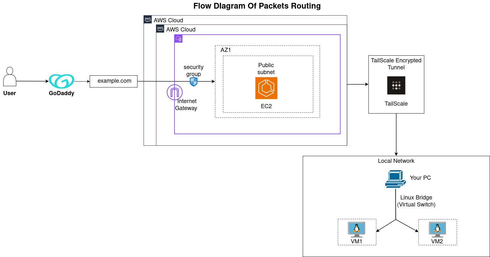

# Hybrid Cloud-to-Local Virtualized Network Architecture

## Important Notice

This repository assumes KVM, QEMU, and Libvirt are already installed and configured

---

## Architecture Diagram



---

## Overview

This project demonstrates a hybrid cloud architecture where an AWS-hosted service securely communicates with locally hosted virtual machines.

It models a real-world setup where cloud infrastructure integrates with on-premise systems using encrypted networking and controlled routing.

The system is structured into modular components (bridge, DHCP, routing, NAT) to clearly separate responsibilities.

---

## Problem Statement

Modern systems often require secure communication between cloud and local environments while maintaining full control over routing, networking, and access.

---

## Solution

This project implements a hybrid networking model using:

* AWS EC2 as a public entry point
* NGINX on EC2 for reverse proxy and TLS termination
* Tailscale (WireGuard) for encrypted connectivity
* Local KVM virtual machines
* Linux bridge networking for VM communication
* dnsmasq for DHCP (IP assignment to VMs)
* iptables for NAT and outbound access

---

## Packet Flow

1. User sends request to domain (example.com)
2. DNS resolves to AWS EC2 public IP
3. Request enters AWS via Internet Gateway
4. NGINX on EC2 terminates TLS and forwards traffic
5. Traffic is sent through Tailscale tunnel
6. Packet reaches local machine via `tailscale0`
7. Linux kernel performs routing using prefix matching
8. Packet is forwarded to bridge (`br-vm`)
9. Bridge delivers traffic to target VM (10.10.0.x)
10. Response returns through the same path

---

## Key Concepts

### Hybrid Cloud Networking

* Extending cloud networking into local infrastructure
* Secure cloud-to-on-prem communication

---

### Linux Networking

* Layer 2 bridging (ARP, switching)
* Layer 3 routing (CIDR, prefix matching)
* NAT using iptables
* DHCP using dnsmasq for dynamic IP allocation

---

### DHCP (dnsmasq)

* Provides IP addresses to VMs connected to the bridge
* Maintains persistent lease mapping
* Uses `br-vm` as the serving interface

---

### Routing (Important)

* Tailscale installs policy routing rules
* Uses a separate routing table (table 52)
* Linux kernel handles forwarding (no user-space proxy required)

---

### Virtualization

* KVM and Libvirt for VM lifecycle
* Persistent bridge-based networking

---

### Secure Networking

* WireGuard-based encrypted tunnels via Tailscale

---

## Tech Stack

* AWS (EC2, VPC)
* NGINX (reverse proxy + TLS termination)
* Tailscale (WireGuard)
* KVM, Libvirt
* Linux networking (bridge, routing, NAT)
* dnsmasq

---

## Features

* Secure hybrid cloud architecture
* Single entry point via EC2 (TLS termination)
* Encrypted communication using WireGuard
* Kernel-based routing (no extra proxy layers locally)
* Scalable VM networking
* NAT-based internet access for VMs

---

## Project Structure

```text id="structure-final"
hybrid-cloud-networking/
├── architecture/        # Diagram and flow
├── nginx/               # EC2 reverse proxy config
├── networking/
│   ├── bridge/          # L2 bridge setup (no DHCP)
│   ├── dns/             # DHCP using dnsmasq
│   ├── nat/             # NAT (iptables)
│   ├── routing/         # Kernel routing + debugging
│   └── tailscale/       # Encrypted connectivity
├── kvm/                 # VM creation and disk management
└── docs/                # High-level setup and troubleshooting
```

---

## About docs/

The `docs/` directory contains:

* End-to-end setup instructions
* Troubleshooting guides
* Common issues and fixes

This is separate from `networking/`, which explains how the system works internally.

---

## What I Learned

* Designing hybrid cloud systems
* Linux networking internals (routing, ARP, NAT)
* Policy-based routing and multiple routing tables
* Virtualization networking
* Debugging multi-layer network flows

---

## Author

Aditya Vaghasiya
DevOps Engineer
Ahmedabad, India

---

## If you found this useful

Give it a star and feel free to connect.
